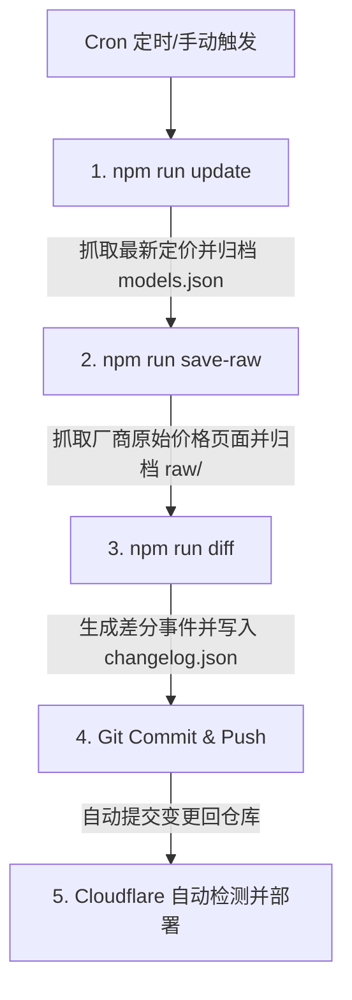

# AI Model Price Radar 项目描述

本项目是一个用于追踪全球主流 AI 模型（如 OpenAI、Anthropic、Google、DeepSeek 以及国内各大主流厂商）API 价格、上下文窗口、缓存折扣等信息的静态网站与数据抓取工具包。

网站前端完全静态化托管在 Cloudflare 平台，通过自动化脚本定期运行最新定价抓取、差分对比、路由别名生成和构建发布。

## 核心脚本介绍

在项目的 [package.json](file:///d:/model-radar/package.json) 中配置了以下核心工作流脚本。它们的具体作用和使用场景说明如下：

### 1. `npm run build`
* **完整命令**：`node scripts/prepare-static.js && npx tailwindcss -i ./src/input.css -o ./public/dist/styles.css --minify`
* **作用说明**：
  * **静态结构与伪静态路由准备**：调用 [prepare-static.js](file:///d:/model-radar/scripts/prepare-static.js) 脚本，清空发布目录 `public/`。读取 `models.json` 中的数据，将基础 HTML 文件以文件夹 + `index.html` 的结构（例如 `about.html` 写入 `public/about/index.html`，把 `model.html` 重复复制为 `public/model/<model-id>/index.html`）生成到 `public/` 目录下。这使得纯静态网站能提供不带后缀的优雅路由 URL（Pretty URLs）。
  * **样式构建与压缩**：调用 Tailwind CSS 将 `./src/input.css` 编译并高度压缩（`--minify`）输出为 `public/dist/styles.css`。
* **使用场景**：在部署上线前、或本地开发验证打包效果时执行。在 GitHub Actions 提交触发 Cloudflare 部署时，Cloudflare 也会在云端自动运行此命令。

### 2. `npm run deploy`
* **完整命令**：`wrangler deploy`
* **作用说明**：调用 Cloudflare 官方 CLI 工具 Wrangler，一键将本地生成的构建目录 `./public` 下的所有静态文件推送并部署至 Cloudflare 服务端。
* **使用场景**：在需要本地手动发布、紧急回滚或调试云端配置时执行。平时会由 GitHub 仓库集成直接托管自动触发，无需手动运行。

### 3. `npm run schema:check`
* **完整命令**：`node scripts/check-structured-data.js`
* **作用说明**：
  * **SEO 结构化数据自检**：对项目中的所有 HTML 模版进行扫描，提取 `<script type="application/ld+json">` 中的结构化数据。
  * **合规性过滤**：验证 JSON 语法，并且拦截那些可能会被 Google 判定为垃圾标记的不合规属性（例如：禁止在 AI 模型页声明商品 `Product` 属性和电商专用 `offers`/`review`，强制 `Dataset` 格式描述长度必须在 50 至 5000 字符内，且禁用 `hasPart` 属性）。
* **使用场景**：当修改或扩展了页面的 JSON-LD 元数据后，用于在提交代码前进行本地 SEO 质量检查。

### 4. `npm run update`
* **完整命令**：`node scripts/update.js`
* **作用说明**：
  * **在线大模型价格抓取**：并发触发 `scripts/providers/` 目录下各个大厂商（如 OpenAI、Google、Anthropic、DeepSeek、火山引擎等）的官方定价页爬虫抓取器。
  * **数据整合与标准化**：将最新抓取的数据与本地基准数据合并，将本币价格与美元折算价以 `7.25` 的固定汇率进行双向补全。对于在厂商官网已经消失的模型，将其 status 标记为 `legacy`（软废弃），防止数据直接被物理删除导致历史记录丢失。
  * **数据同步输出**：将汇总后的数据集保存至 `data/models.json` 并归档到 `data/history/<YYYY-MM-DD>.json` 中。
* **使用场景**：每天定时通过定时任务运行（如 GitHub Actions cron 触发），获取最新的全球大模型 API 价格。

### 5. `npm run diff`
* **完整命令**：`node scripts/diff.js`
* **作用说明**：
  * **价格变动与追踪差异生成**：对比当前最新的 `data/models.json` 与上一次缓存备份的 `models.previous.json`。
  * **生成更新日志**：自动检测出在这期间发生的所有变更事件（如：新增模型、移除模型、价格上调、价格下调、缓存折扣变化等），并将其折算成格式化的变更摘要，合并记录到 [changelog.json](file:///d:/model-radar/data/changelog.json) 历史记录中，用于前端页面上“历史记录”页面的展示。
* **使用场景**：作为大模型价格更新流水线（Update Pipeline）的一部分，紧随 `npm run update` 之后执行。

### 6. `npm run save-raw`
* **完整命令**：`node scripts/save-raw.js`
* **作用说明**：
  * **原始网页快照存档**：拉取各大厂商官网的原始 HTML 价格页面，原封不动地保存至项目根目录下的 `raw/<provider>/<Year>/<Month>/<Day>.html` 中，建立原始网页档案库。
  * **特殊解析机制**：针对采用 Next.js 等动态预加载页面构造的厂商（如月之暗面 Kimi、火山引擎），在抓取时会通过 AST/正则表达式技术解析出其混淆在预加载数据中的原始表格数组，并在本地重新渲染还原出标准的静态 HTML 表格插回 DOM 中，保证备份的 HTML 文件高度可读。
* **使用场景**：每日定时抓取，作为发生争议或需要追溯厂商定价变动证据时的原始网页存档。

---

## 自动化运行工作流

在 GitHub Actions 中的自动化脚本配置（如 [.github/workflows/update.yml](file:///d:/model-radar/.github/workflows/update.yml)）每 12 小时会自动运行一次以下链式工作流，实现全自动的“抓取 - 差分 - 归档 - 提交”流程：

