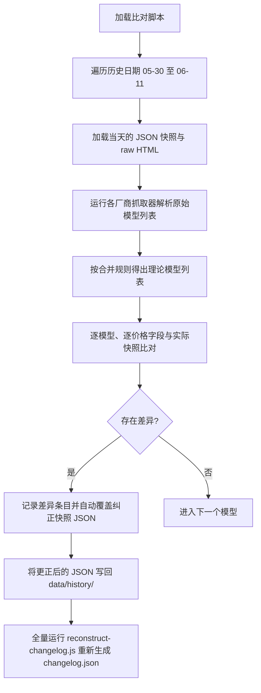

# 历史快照数据验证与清洗设计方案

本项目是一个静态价格雷达，记录了各大主流 AI 模型的价格变化。保持数据与官网原始数据的 100% 相同是开发的第一原则。本设计方案旨在通过对比本地缓存的原始 HTML 数据与 `data/history` 下的历史 JSON 快照，检查并自动订正所有不准确的历史价格和状态，然后全量重建 Changelog 历史。

## 验证与设计逻辑

> [!IMPORTANT]
> 仅对具有 `raw` 缓存的 13 天历史快照（即 2026-05-30 至 2026-06-11）进行物理一致性校验与清洗。对于 2026-05-15 至 2026-05-29 之间缺失原始抓取网页的日期，应当不做任何改动并维持原有状态。

### 1. 提供商与 HTML 文件的映射关系
为了能自动调取各提供商在不同时间的原始 HTML 数据，设计以下提供商到 `raw` 子文件夹的映射关系：
*   `OpenAI` ➔ `raw/openai/{year}/{month}/{day}.html`
*   `Anthropic` ➔ `raw/anthropic/{year}/{month}/{day}.html`
*   `Google` ➔ `raw/google/{year}/{month}/{day}.html`
*   `DeepSeek` ➔ `raw/deepseek_zh/{year}/{month}/{day}.html`
*   `月之暗面` ➔ `raw/moonshot/{year}/{month}/{day}.html`
*   `阿里通义` ➔ `raw/alibailian/{year}/{month}/{day}.html`
*   `字节豆包` ➔ `raw/volcengine/{year}/{month}/{day}.html`
*   `腾讯混元` ➔ `raw/hunyuan/{year}/{month}/{day}.html`

### 2. 比对与计算公式设计
模型价格合并与标准化算法与 `scripts/update.js` 完全对齐，在比对时采用以下规则：
*   **价格浮点数规整**：使用高精度四舍五入 `roundPrice` 保留 6 位小数进行全等比对：
    ```javascript
    function roundPrice(val) {
      return Math.round(val * 1000000) / 1000000;
    }
    ```
*   **双币种双向换算比对**：
    *   国内厂商（字节豆包、阿里通义、月之暗面、腾讯混元）采用官方本币 CNY 换算美元。汇率固定为 `7.25`。
    *   若快照中的 CNY 价格或 USD 价格与理论上基于原始抓取结果根据合并规则（`normalizeProviderModel`）计算出的本币或折算价格有差异，判定为不准确。
*   **比对关键字段**：
    *   `inputPricePer1M` / `inputPriceUsdPer1M`
    *   `outputPricePer1M` / `outputPriceUsdPer1M`
    *   `cacheWritePricePer1M` / `cacheWritePriceUsdPer1M`
    *   `cacheReadPricePer1M` / `cacheReadPriceUsdPer1M`

### 3. 数据状态检验设计
*   **新旧版本模型校对**：核对历史快照中存在而原始 HTML 中不存在的遗留模型是否正确标记为了 `status: "legacy"`。
*   **ID 重命名遗留校对**：验证在进行之前的 ID 订正过程中，历史 JSON 文件中是否仍残存 dotted 格式的旧 ID 或遗留的多余重复项。

---

## 验证与清洗实现流程



### 验证步骤
1. 编写只读分析与诊断比对脚本 `scripts/validate-history.js`；
2. 运行诊断脚本，将打印的所有模型差异信息保存至 `artifacts/`；
3. 将纠偏及覆盖写入逻辑整合到该脚本中，运行对 `data/history/` 历史快照的物理修复；
4. 运行 `git diff` 验证数据订正范围，确保不产生时效性抓取的网络脏增量；
5. 执行 `npm run build` 和 `npm run schema:check` 验证静态编译和数据校验全部通过。
